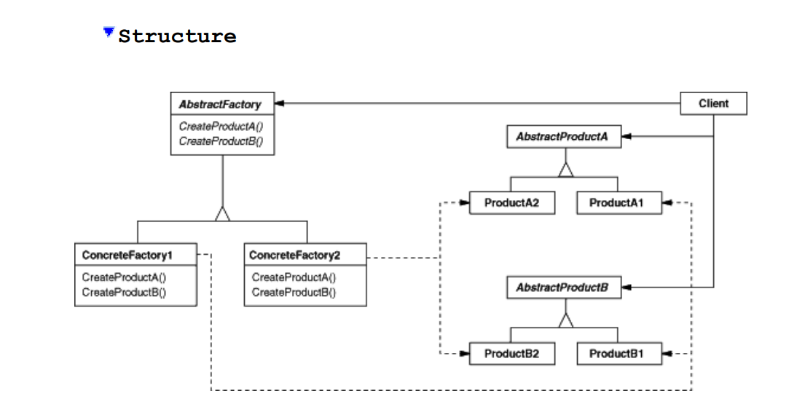

# Abstract Factory Pattern or KIT

## Intent
Provide an interface for creating families of related or dependent objects without specifying their concrete classes.
## Motivation

Consider a user interface toolkit that can be used to create different types of user interface like scroll bars, windows, buttons etc. To be portable across look-and-feel standards, an application should
not hard-code its widgets for a particular look and feel.

To solve this problem, we can define an abstract factory that creates the widgets. The abstract factory will be responsible for creating the widgets and the application will use the abstract factory to create the widgets. The application will not be aware of the concrete classes of the widgets. The application will only know about the abstract factory and the abstract classes of the widgets.

There is a concrete subclass of the abstract factory for each look-and-feel standard. The concrete subclass will create the widgets for that look-and-feel standard. The application will use the abstract factory to create the widgets and the concrete subclass will create the concrete widgets.

## Applicability
Use the Abstract Factory pattern when
1. A system should be independent of how its objects are created, composed, and represented.
2. A system should be configured with one of multiple families of objects.
3. A family of related or dependent objects is designed to be used together, and you need to enforce this constraint.
4. You want to provide a class library of products, and you want to reveal just their interfaces, not their implementations.

## Participants
1. AbstractFactory: declares an interface for operations that create abstract product objects.
2. ConcreteFactory: implements the operations to create concrete product objects.
3. AbstractProduct: declares an interface for a type of product object.
4. ConcreteProduct: implements the interface for a concrete product object.
5. Client: uses only interfaces declared by AbstractFactory and AbstractProduct classes.

## Trade-offs
1. it isolates concrete classes. The Abstract Factory pattern helps you control the classes of objects that an application creates. Because a factory encapsulates the responsibility and the process of creating product objects, it isolates clients from implementation classes.
2. It makes exchanging product families easy. The Abstract Factory pattern makes it easy to exchange product families. You can configure an application with a different factory and get a different family of products.
3. It promotes consistency among products. The Abstract Factory pattern helps you enforce the constraints that products in a family are designed to work together.
4. Supporting new kinds of products is difficult. The Abstract Factory pattern makes it hard to support new kinds of products. You have to change the abstract factory and all the concrete factories to add a new product.