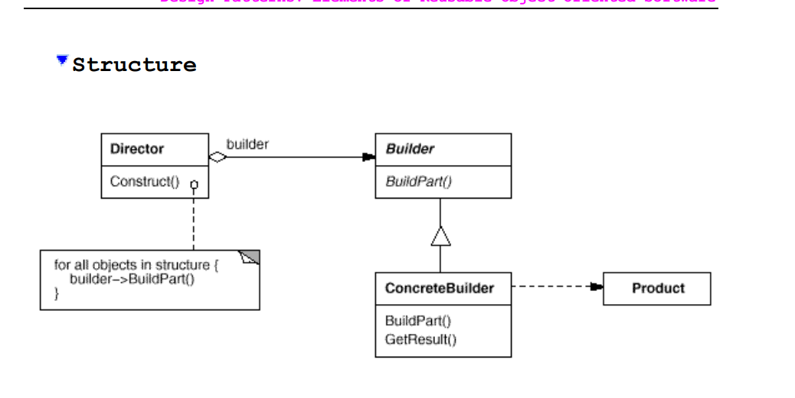

# Builder Pattern

## Intent
Separate the construction of a complex object from its representation so that the same construction process can create different representations.

## Motivation
Consider a complex document that can be represented in different formats, such as HTML, PDF, or Markdown. The construction of the document involves multiple steps, such as adding headings, paragraphs, images, and links. By using the Builder pattern, you can create a document builder that encapsulates the construction logic and allows you to generate different representations of the document without changing the underlying construction process.

## Applicability
Use the Builder pattern when:
1. The algorithm for creating a complex object is independent of the parts that make up the object and how they're assembled.
2. The construction process must allow different representations for the object that is constructed.

## Participants
1. Builder: defines an interface for creating parts of a complex object.
2. ConcreteBuilder: implements the Builder interface and constructs the parts of the complex object.
3. Director: constructs the complex object using the Builder interface.
4. Product: represents the complex object that is being built.

## Trade-offs

1. It isolates the construction of a complex object from its representation. The Builder pattern allows you to create different representations of a complex object without changing the construction process.
2. It provides a clear separation of concerns. The Builder pattern separates the construction logic from the representation logic, making it easier to maintain and extend the code.
3. It allows for more flexible and reusable code. The Builder pattern allows you to create different representations of a complex object without changing the construction process, making it easier to reuse the code in different contexts.