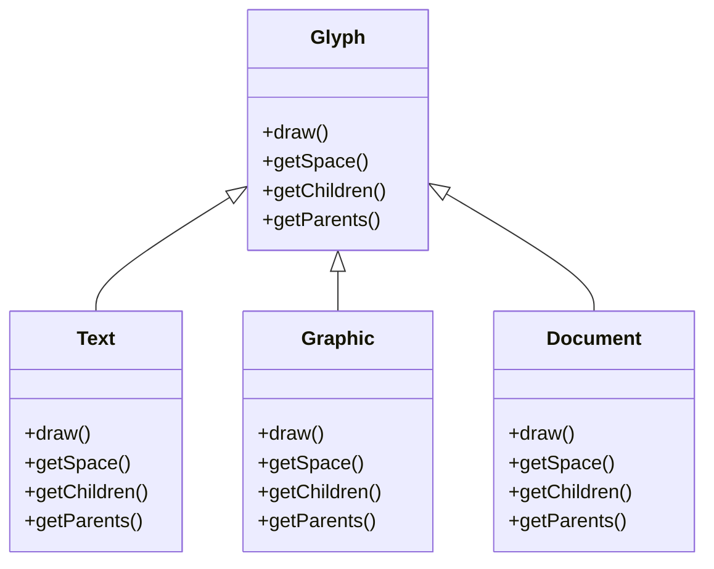

# A Case Study: Design a Document Editor

## Design Problems

## Document Structure: 

Document is just a collection of text and graphical elements such like line, polygon and other shapes. But editor will see this not in terms of text and graphical elements but in terms of document physical structure like lines, figures,tables and other substructures. And also substructures can be nested.

In particular, the internal representation should support the following: 

1. Maintain the document physical structure ,  the arrangement  of text and graphical elements into line columns, paragraphs, and tables.
2. Generate and presenting the document visually
3. Mapping positions on the display to the document structure

Recursive Composition is a good way to represent the document structure. The document is a composite object, and the text and graphical elements are its components. The document can be represented as a tree structure, where page is made of columns composite object and each column object will made of composite row object and each row object will made of composite cell object and each cell object will made of text or graphical elements.

Glyph abstract class is a good way to represent the document structure. The glyph class is the base class for all the text, graphical and structural elements.

Glyph have the following responsibilities:
 1. how to draw itself
 2. what space it occupies
 3. Their children and parents in the document structure

Show me diaggram of glyph class

## Formatting:

Formatting is the process of determining how the text and graphical elements are arranged in the document. The formatting process is responsible for determining the size, position, and appearance of the text and graphical elements in the document.

By the way, we'll restrict "formatting" to mean breaking a collection of glyphs into lines. In fact, we'll use the terms "formatting" and "linebreaking" interchangeably. The techniques we'll discuss apply equally well to breaking lines into columns and to breaking columns into pages.

### Encapsulating the formatting algorithm
The formatting algorithm is responsible for determining how the text and graphical elements are arranged in the document. The formatting algorithm is responsible for determining the size, position, and appearance of the text and graphical elements in the document. While deciding the algorithm, we factor like response time, better formatting, and better performance.

Because the formatting algorithm is a complex process, we need to encapsulate it in a separate class. We should design so that its easy to change the formatting algorithm at the compile time if not at run time as well. We can isolate the algorithm from the rest of the system. We will define a separate class hierarchy for the formatting algorithm. The base class will be an abstract class, and the concrete classes will implement the formatting algorithm. The base class will define the interface for the formatting algorithm, and the concrete classes will implement the formatting algorithm.

